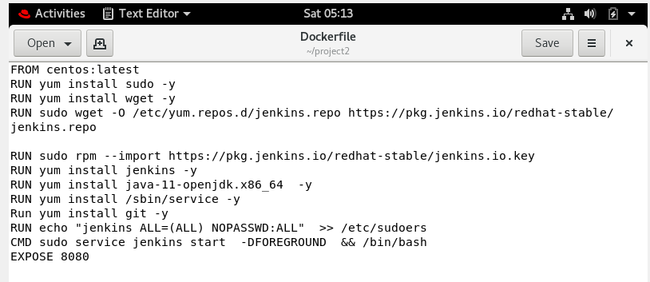
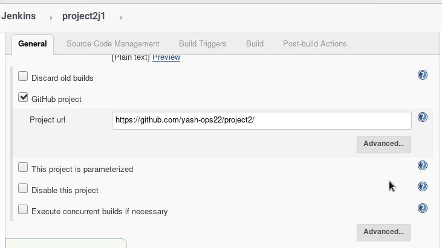
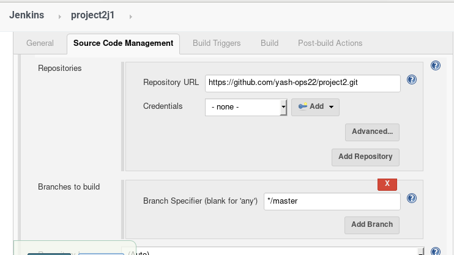
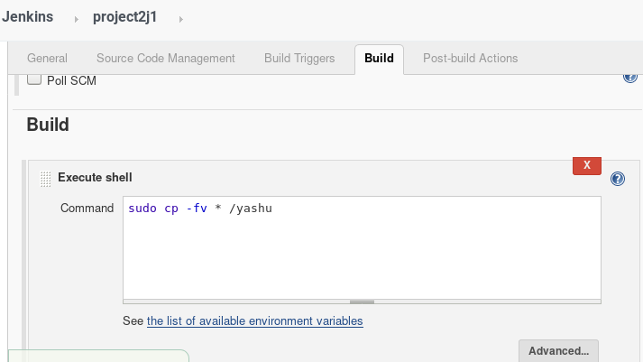
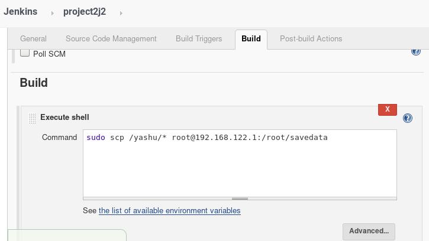
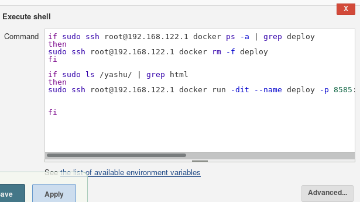
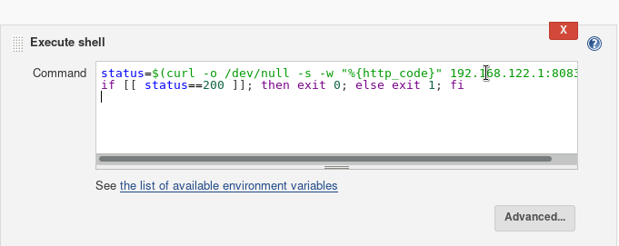
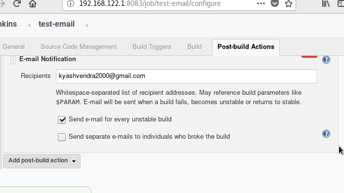
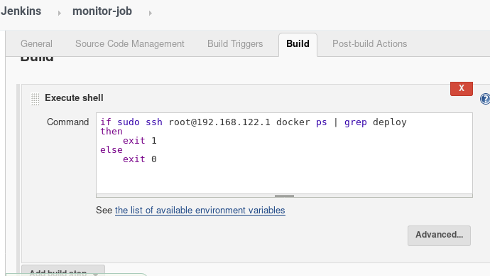
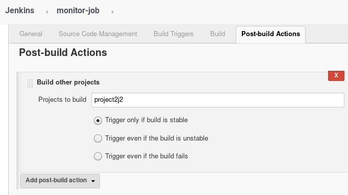

 # PROJECT_2

Step 1: Here we are Creating a docker container using Dockerfile which has jenkins installed. When We  run this image with port 8083,            it automatically starts jenkins service.
          

 Step 2: A job chain of jobs.
  
Step 3: Jenkins will pull the github repo on any push. 
         
         

This code  will be copied to our running container.
 
 
  

 Step 4: After this we will transfer this data to our base OS in directory savedata.
         

 Step 5: By looking at the code extension jenkins automatically starts the respective language interpreter by installing image                   container for deploying the code. Here we have used HTML language only.First it will check if the container with the same name           is running in background, if it is,the it will stop and will launch new one.
           

 Step 6: A job will check the container. For any error it will send an error message to the given email.
          
          

 Step 7: An extra job  will monitor the container if it is working or not. If not, then it will launch the container again.
         
         

# Suggestions Are Welcomed IF anything is Wrong.
